# SHIP-AI
SHIP-AI is a part of Institute for Artificial Intelligence (IKIM) at the University Hospital Essen.
This theme uses the color palette of SHIP-AI.

Enjoy 🛳️

### SHIP-AI-dark
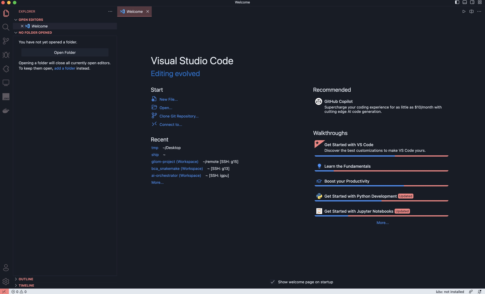
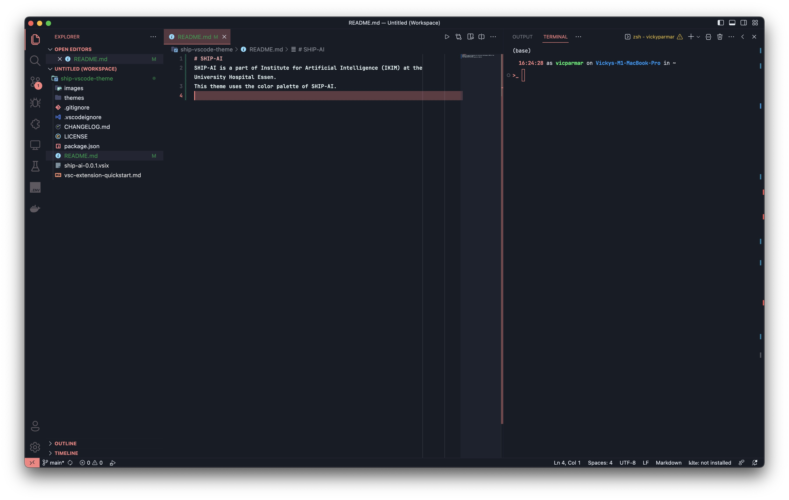
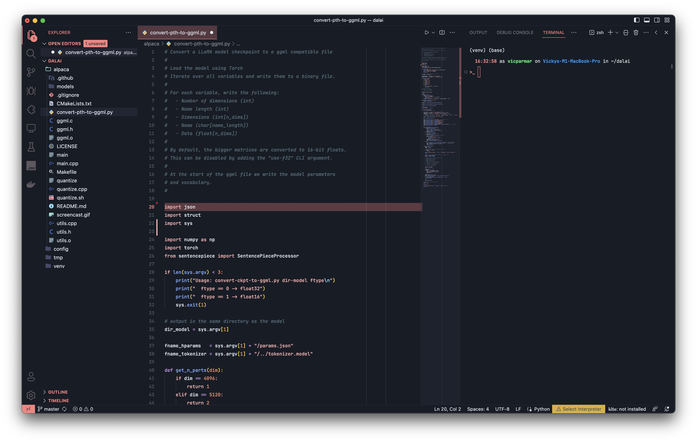
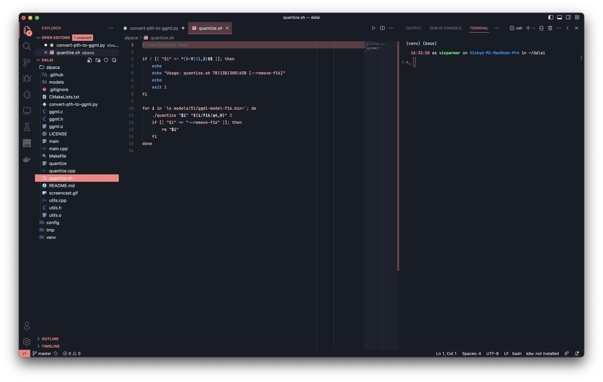
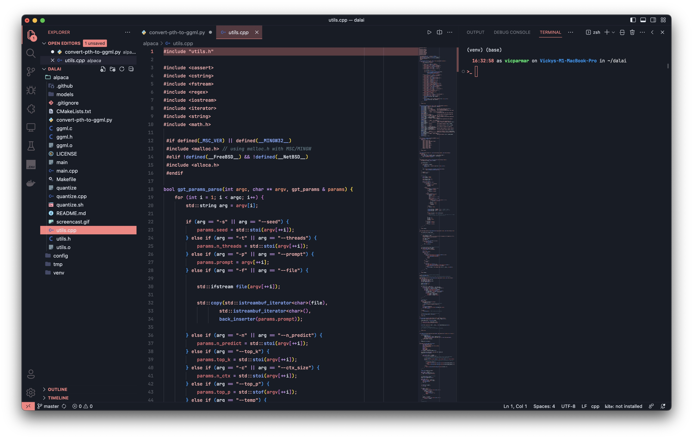
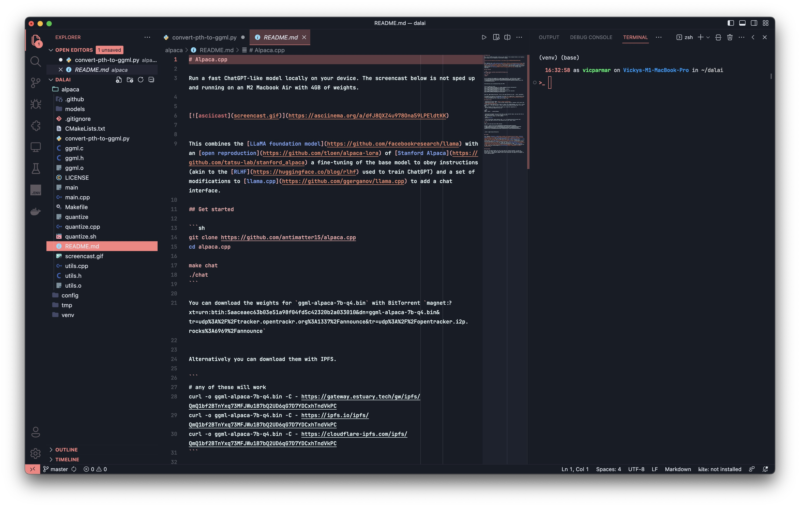

### SHIP-AI-light
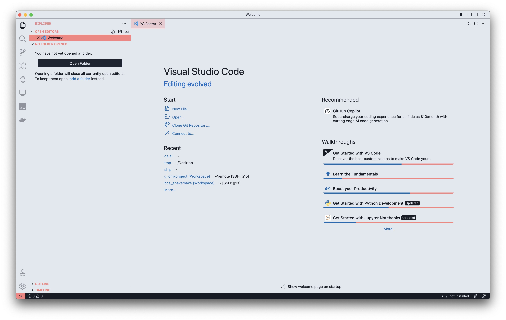
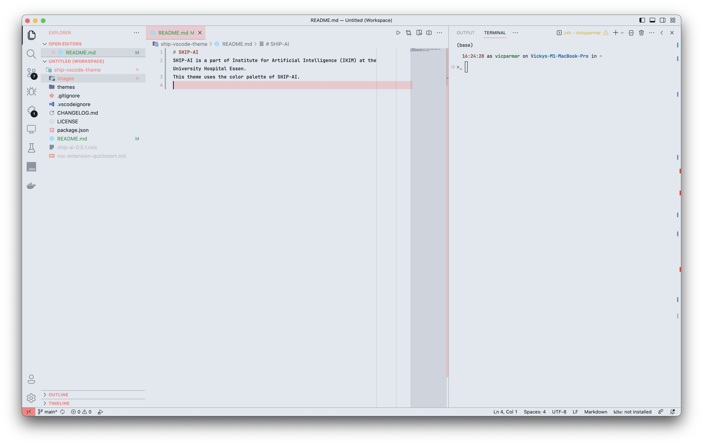
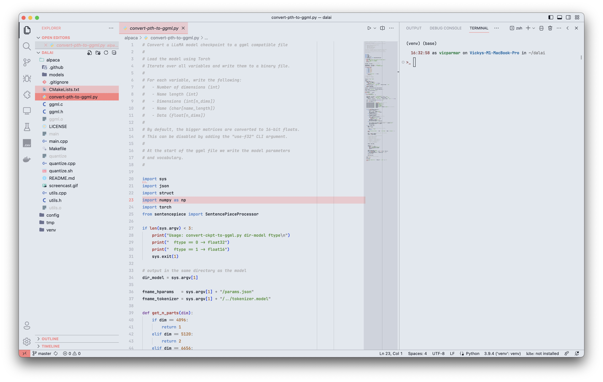
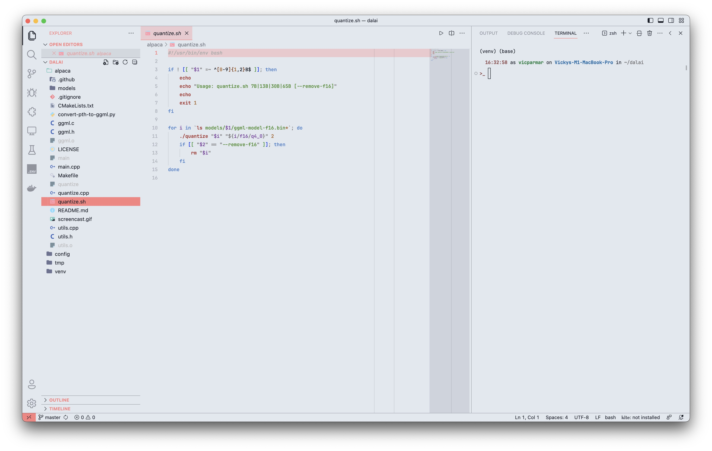
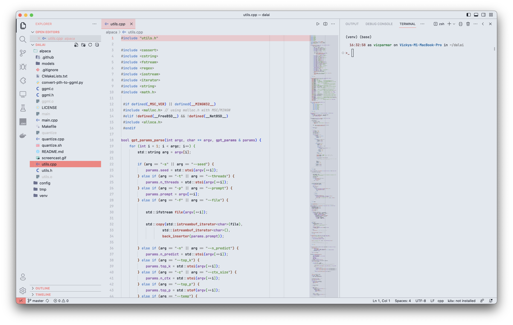
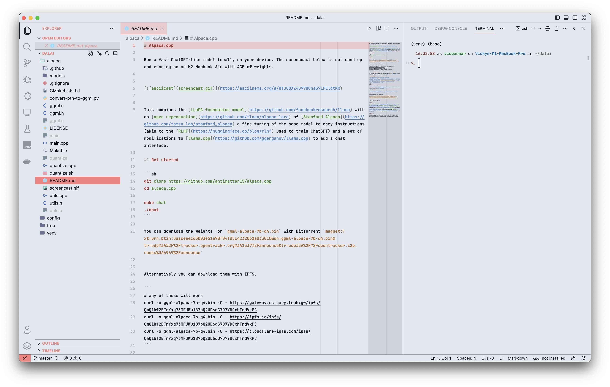
